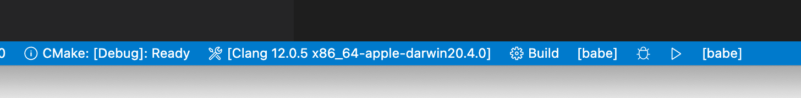
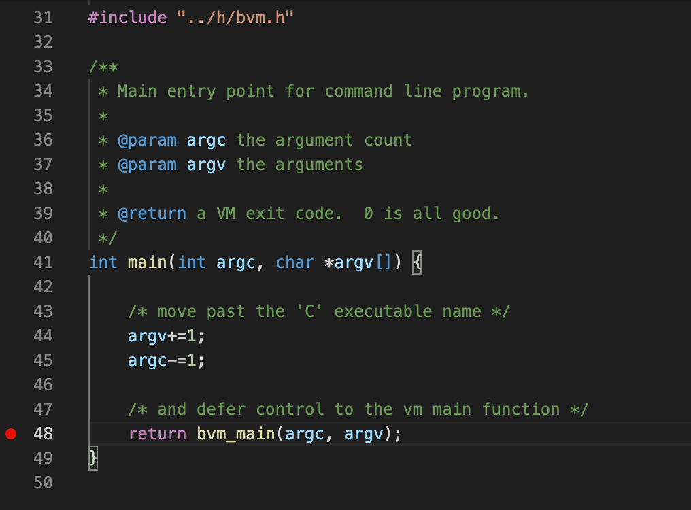
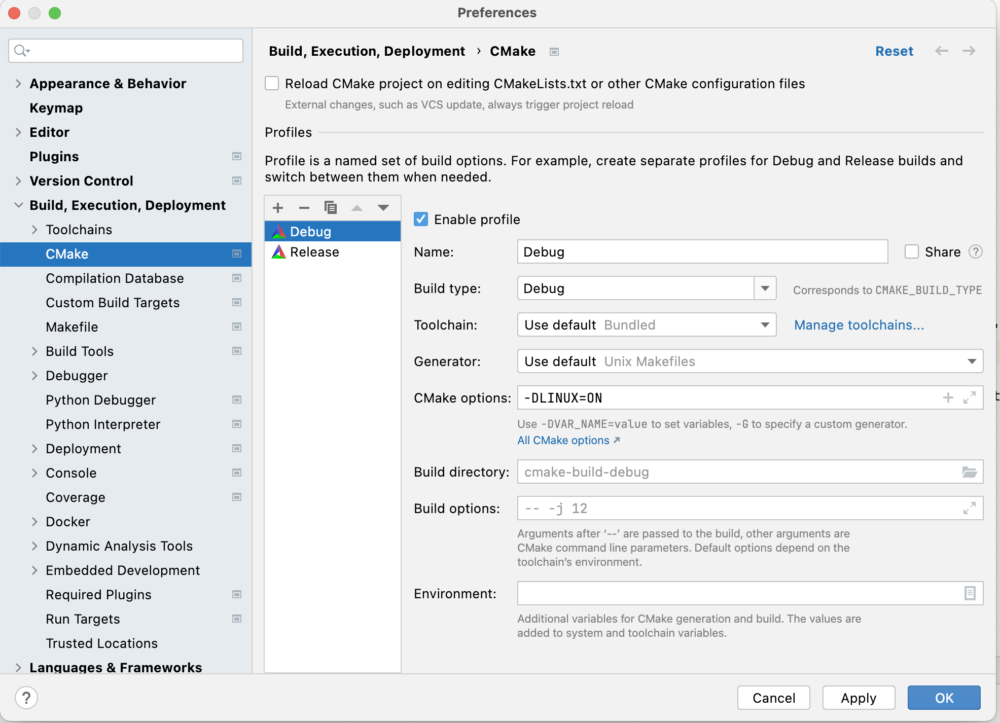
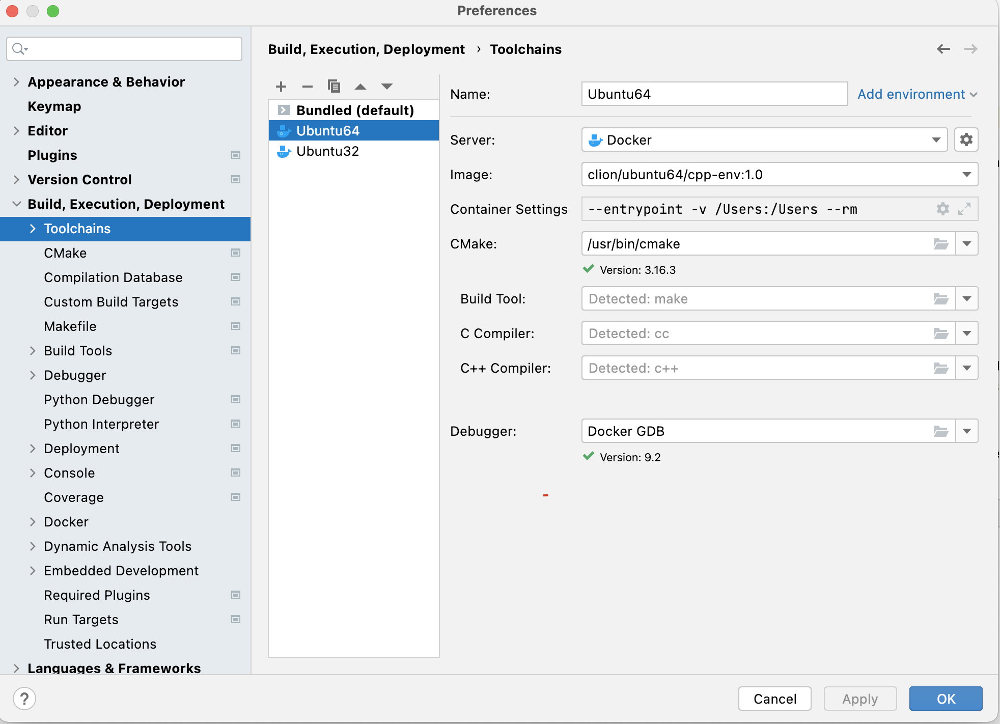
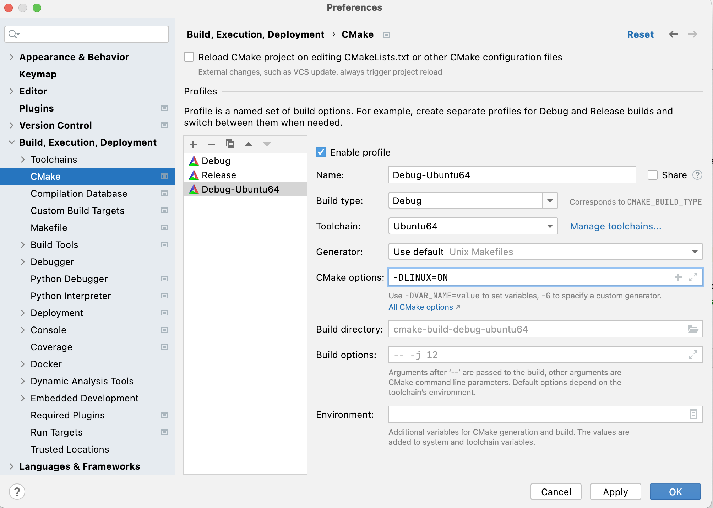
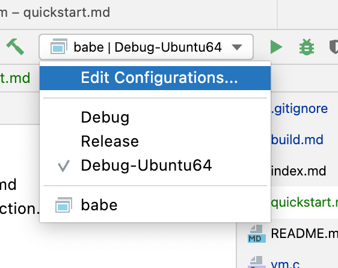

# Quick start

The following is to get you running and debugging the VM C code executing a `HelloWorld.java` class in either VSCode or Clion for mac.  Windows/Linux may be different.

The `lib` folder in this repo has the `HelloWorld.java` class, its compiled version `HelloWorld.class`, plus the runtime libs already built as `rt-0.6.0.jar` (the version may change over time, so be sure to check exactly which version is in there).  So, we'll get things configured to run the VM code and have it search that folder for the rt jar and java class. 

## VS Code

You'll need the following extensions installed: 

* "C/C++ for Visual Studio Code" from Microsoft.
* "CMake Tools", also from Microsoft.

* If you have not already installed them, or do not have xcode installed, you may also need to install the C command line tools using `xcode-select --install`.

You'll also need `cmake` installed on your system.  For linux, this is likely already there, for mac visit `https://cmake.org/download/` and download and install the dmg to 'Applications'. You'll need to add `/Applications/CMake.app/Contents/bin` onto your path in your shell profile (likely `.zprofile` in your user folder).  Test it works with `cmake -version`.

After that, Open the Command Palette (⇧⌘P) in vscode and run "CMake: Scan for Kits".  It should pick up the installed C compiler.

For mac/linux, we'll want to be able to pass the `LINUX=ON` config to cmake, so create a new file in project root called `cmake-variants.yaml` with the following contents:

```yaml
buildType:
  default: debug
  choices:
    debug:
      short: Debug
      long: Emit debug information
      buildType: Debug
      settings:
        LINUX: "ON"
    release:
      short: Release
      long: Optimize generated code
      buildType: Release
      settings:
        LINUX: "ON"
```

For windows, it'll be `WINDOWS=ON`.

You'll need to create a new launch configuration.  You can use the menu `Run -> Add Configuration` to get going.  Here is a working example given the toolchain I have installed:

```json
{
    "version": "0.2.0",
    "configurations": [
        {
            "name": "(lldb) Launch",
            "type": "cppdbg",
            "request": "launch",
            "program": "${workspaceRoot}/build/babe",
            "args": ["-Xbootclasspath", "../lib/rt-0.6.0.jar", "-cp",  "../lib", "HelloWorld"],
            "stopAtEntry": false,
            "cwd": "${fileDirname}",
            "environment": [],
            "externalConsole": false,
            "MIMode": "lldb"
        }
    ]
}
```

You should now see the blue base bar as such:



You can choose the cmake profile to build with on the left, and build with the 'build' icon on the right.  Note that the run icon on the right will not run the above launch configuration - it'll just run the executable.  So, you'll need to select a `Run` menu option to get going.   

When you run it you should see a 'Hello World' in the console.  Hopefully.

Now, open `src/babe.c` and put a breakpoint as below and select `Run -> Start Debugging` from the menu.



Happy debugging. 

## CLion setup

In settings 'Build, Execution, Deployment -> cmake' create two new cmake profiles 'Debug' and 'Release' and configure as same except for the 'build type'.  Use the default toolchain and specify command line options like:



A linux debug cmake profile has the following command line options.  The linux build works on OSX without any mods.

```
-DLINUX=ON
```

And for windows:

```
-DWINDOWS=ON
```

From the `Build` menu, you can now do a `Build all in Debug`.
 

### Cross compile with docker

Using the linux 64 bit docker as an example.  From the project root, run the following to create an image for CLion:

```
docker build -t clion/ubuntu64/cpp-env:1.0 -f ./docker/Dockerfile.cpp-env-ubuntu64 .
```

In Clion settings/preferences `Build, Execution, Deployment -> Toolchains` set up a new Docker toolchain and select the image we created above: `clion/ubuntu64/cpp-env:1.0` as such:  



On mac, I did have to add a mount to the `/Users` folder so I could test with classes residing in projects under that root folder.  The mounting is done in the docker toolchain 'Container settings'.  I had `--entrypoint -v /Users:/Users --rm`.  The 'Container settings' setting was added in Clion 2022.1

You'll need a new cmake profile that specifies the new docker toolchain:



And then you can select the new cmake profile and build it:



The same run target configuration will also work with the new docker cmake profile. 

For 32 bit, the same applies, but on the cmake profile, add in a flag for 32 bit such that the cmake profile would look like:

```
 -DLINUX=ON -D32BIT=ON
```

I would say if your needs go beyond choosing between windows/linux and 64/32 bit (and they likely will) just create your own build file.

#### Running the VM inside a docker

After the docker build above is set up, the VM can be executed inside a docker from a terminal like such:

```
docker run --rm -v /Users:/Users clion/ubuntu64/cpp-env:1.0 /Users/<path-to-VM-exe> <vm command line stuff>
```

If the command line params specify a JDWP port, then that will need to be provided to docker command line.

## The SDK class / path

To be able to run any Java-compiled code, this project needs the Babe runtime classes.  If the included lib rt.jar does not suit you needs, pull the runtime classes project at [https://github.com/babevm/runtime](https://github.com/babevm/runtime) and do a maven build on it.  The path to the built `.class` artifacts, or jar file needs to be passed on the command line as `-Xbootclasspath`.  Additionally, the classpath for non-system classes will need to be provided as `-cp` (or `-classpath`).  The classpath can have multiple segments each separated by an os-dependant path separator char - ';' or ':'.  A segment can be a jar file.  Note that path segments, plus class file names cannot exceed 255 chars or bad stuff will happen.

Here is an example invocation:

```
-heap 256k -Xbootclasspath <sdk-classpath> -cp <user-classpath> com.stuff.MyProg
```


